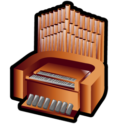

<!-- PROJECT LOGO -->
<br />
<div align="center">
  <a href="https://github.com/SgilPro/MCBach">
    
  </a>

  <h3 align="center">MC Bach</h3>

  <p align="center">
    An mind-blowing community for your joyful music and social experience!
    <br />
    <a href="https://github.com/othneildrew/Best-README-Template">View Demo</a>
    ·
    <a href="https://github.com/othneildrew/Best-README-Template/issues/new?labels=bug&template=bug-report---.md">Report Bug</a>
    ·
    <a href="https://github.com/othneildrew/Best-README-Template/issues/new?labels=enhancement&template=feature-request---.md">Request Feature</a>
  </p>
</div>

## Tech Stack

[![NestJs][nestjs-shield]][ref-nestjs]
[![NodeJs][nodejs-shield]][ref-nodejs]
[![Typescript][typescript-shield]][ref-typescript]
[![MongoDB][mongodb-shield]][ref-mongodb]
[![JWT][jwt-shield]][ref-jwt]
[![Jest][jest-shield]][ref-jest]
[![Docker][docker-shield]][ref-docker]

## Description

[Nest](https://github.com/nestjs/nest) framework TypeScript starter repository.

## Installation

```bash
$ npm install
```

## Running the app

```bash
# development
$ npm run start

# watch mode
$ npm run start:dev

# production mode
$ npm run start:prod
```

## Test

```bash
# unit tests
$ npm run test

# e2e tests
$ npm run test:e2e

# test coverage
$ npm run test:cov
```

## Support

Nest is an MIT-licensed open source project. It can grow thanks to the sponsors and support by the amazing backers. If you'd like to join them, please [read more here](https://docs.nestjs.com/support).

## Stay in touch

- Author - [d9niel.code@gmail.com](mailto:d9niel.code@gmail.com)

## License

**MC Bach** is [MIT licensed](LICENSE).

<!-- BADGE LINKS -->

[ack-contributors-shield]: https://img.shields.io/github/contributors/andrechristikan/ack-nestjs-boilerplate?style=for-the-badge
[ack-forks-shield]: https://img.shields.io/github/forks/andrechristikan/ack-nestjs-boilerplate?style=for-the-badge
[ack-stars-shield]: https://img.shields.io/github/stars/andrechristikan/ack-nestjs-boilerplate?style=for-the-badge
[ack-issues-shield]: https://img.shields.io/github/issues/andrechristikan/ack-nestjs-boilerplate?style=for-the-badge
[ack-license-shield]: https://img.shields.io/github/license/andrechristikan/ack-nestjs-boilerplate?style=for-the-badge
[nestjs-shield]: https://img.shields.io/badge/nestjs-%23E0234E.svg?style=for-the-badge&logo=nestjs&logoColor=white
[nodejs-shield]: https://img.shields.io/badge/Node.js-339933?style=for-the-badge&logo=nodedotjs&logoColor=white
[typescript-shield]: https://img.shields.io/badge/TypeScript-007ACC?style=for-the-badge&logo=typescript&logoColor=white
[mongodb-shield]: https://img.shields.io/badge/MongoDB-white?style=for-the-badge&logo=mongodb&logoColor=4EA94B
[jwt-shield]: https://img.shields.io/badge/JWT-000000?style=for-the-badge&logo=JSON%20web%20tokens&logoColor=white
[jest-shield]: https://img.shields.io/badge/-jest-%23C21325?style=for-the-badge&logo=jest&logoColor=white
[docker-shield]: https://img.shields.io/badge/docker-%230db7ed.svg?style=for-the-badge&logo=docker&logoColor=white
[github-shield]: https://img.shields.io/badge/GitHub-100000?style=for-the-badge&logo=github&logoColor=white
[linkedin-shield]: https://img.shields.io/badge/LinkedIn-0077B5?style=for-the-badge&logo=linkedin&logoColor=white

<!-- Reference -->

[ref-nestjs]: http://nestjs.com
[ref-mongoose]: https://mongoosejs.com
[ref-mongodb]: https://docs.mongodb.com/
[ref-nodejs]: https://nodejs.org/
[ref-typescript]: https://www.typescriptlang.org/
[ref-docker]: https://docs.docker.com
[ref-dockercompose]: https://docs.docker.com/compose/
[ref-12factor]: https://12factor.net
[ref-nestjscommand]: https://gitlab.com/aa900031/nestjs-command
[ref-jwt]: https://jwt.io
[ref-jest]: https://jestjs.io/docs/getting-started
[ref-git]: https://git-scm.com
